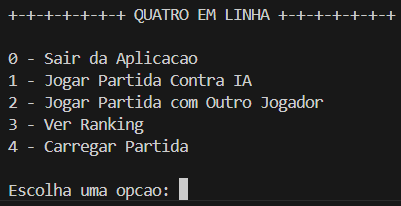
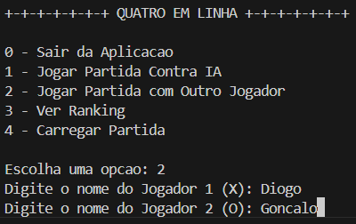
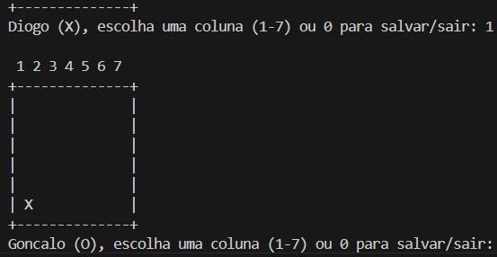
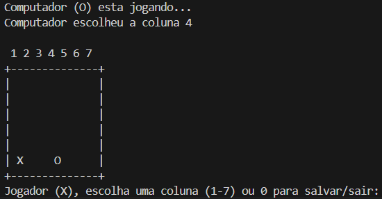
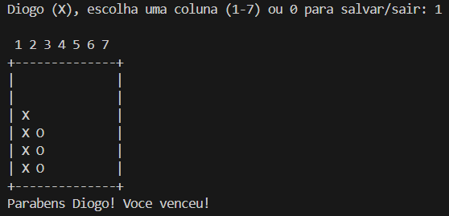
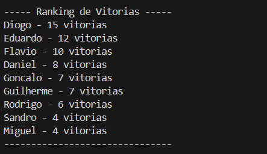

<div style="text-align:center;">
  
</div>

# Quatro em Linha

O jogo quatro em linha (também conhecido como Conecta/ Liga 4 em Linha) é um jogo de tabuleiro estratégico para dois. O objetivo do jogo é ser o primeiro a alinhar quatro peças do mesmo símbolo, seja na horizontal, vertical ou diagonal.

Este projeto, criado por Diogo Macedo e Gonçalo Santos do 1º PWDAM do Instituto Politécnico de Setíubal, tem como objetivo recriar o jogo, bem como aprofundar os conhecimentos da linguagem de programação C, de modo a que os estudantes possam aplicar os conhecimentos lecionados em aula, assim como as suas aptidões lógicas na resolução de problemas, no âmbito da cadeira de Fundamentos de Programação e Algoritmos.

<br>

# Tabela de Conteúdos

- [Manual de Utilizador](#manual-de-utilizador-do-programa)

- [Requisitos Mínimos](#requisitos-mínimos)

- [Como Instalar](#como-instalar)

- [Recursos](#recursos)

- [Implementação](#implementação)

- [Conclusão](#conclusão)

- [Créditos](#créditos)

# Manual de Utilizador do Programa

1. Ao iniciar o programa, encontrará o menu do programa, onde poderá escolher o modo do jogo:

- Sair do Programa (opção 0)
- Singleplayer (opção 1)
- Multiplayer (opção 2)
- Ver Ranking (opção 3)
- Carregar Partida (opção 4)

`Lista/Menu Inicial`



`Lista/Menu Inicial - Opção 2 escolhida`



`Jogada do Jogador 2`

2. Ao iniciar a partilha, escolha a coluna que pretenda inserir o símbolo (numeradas de 1 a 7).

3. Crie uma combinação no tabuleiro, sem deixar o adversário fazer o mesmo.



`Jogada do Computador`



`Final da partida`

4. Após o final do jogo, repita o mesmo processo.



`Tabela de Ranking`

5. Ao clicar na opção 3, visualize o ranking dos jogadores com mais vitórias.



# Requisitos Mínimos

Para executar o programa criado, terá que atender aos seguintes requisitos:

- Processador: Qualquer CPU compatível (x86, x64, ARM, etc.);

- Memória RAM: A partir de 512 MB;

- Sistema Operativo: Windows, Linux, macOS ou qualquer sistema que suporte compilador C;

- Compilador C (E.g.):

  - GCC (GNU Compiler Collection);
  - Clang;
  - MSVC (Microsoft Visual C++);
  - TCC (Tiny C Compiler).

- Bibliotecas e Ferramentas C;

- Terminal ou Ambiente de Desenvolvimento.

# Como Instalar

Para poder instalar o jogo, seguem-se os seguintes passos:

- Primeiro, dirija-se à pasta compartilhado, onde contém o presente jogo, bem como este relatório e transfira-a;

- Segundo, abra o terminal do seu Sistema Operativo ou do Ambiente de Desenvolvimento e execute os seguintes comandos:

```bash
gcc main.c -o main.exe

./main.exe
```

> ### 📖 Explicação
>
> O primeiro comando compilará os ficheiros header e .c, junto com o ficheiro principal.
> O segundo irá executar a aplicação.

- Ou simplesmente clique nos botões de 'Compilar' em seguida 'Executar', no caso esteja num Ambiente de Desenvolvimento.

> ### 💡 Dica
>
> Se não tiver um compilador instalado (MacOS e Linux já veem com compilador predefinido), instale MinGW-w64 (Windows x64), e em seguida, guarde o caminho do compilador nas Variáveis de Ambiente.

# Recursos

### Modos de Jogo:

- Modo Singleplayer: O jogador compete contra a IA, que escolhe jogadas de forma aleatória.
- Modo Multiplayer: Dois jogadores podem jogar entre si no mesmo dispositivo.

### Funcionalidades do Jogo:

- Sistema de Menu: Permite ao utilizador escolher entre iniciar um jogo, selecionar o modo de jogo ou sair da aplicação.
- Retorno Automático ao Menu: Após o término de cada partida, o jogo volta automaticamente ao menu principal, oferecendo a possibilidade de iniciar um novo jogo ou sair.
- Validação de Jogadas: Impedimento de jogadas inválidas, como selecionar colunas fora do alcance ou jogar em colunas cheias.
- Detecção de Vitória: O jogo identifica automaticamente quando um jogador coloca quatro peças consecutivas na horizontal, vertical ou diagonal.
- Verificação de Empate: Se o tabuleiro estiver cheio e não houver vencedor, o jogo declara um empate.
- Tabela de Ranking: Visualização dos jogadores que mais venceram partidas (apenas válido em multiplayer).

### Interação do Utilizador:

- Entrada Simples de Colunas: O jogador apenas precisa introduzir o número da coluna para fazer uma jogada.
- Indicação da IA: No modo singleplayer, o jogo indica qual coluna foi escolhida pela IA.
- Administração de Partidas: O jogo permite ao utilizador poder salvar os jogos a meio, e eventualmente continuar a jogá-los mesmo depois do terminal ser fechado.

### Outros Recursos:

- Tabuleiro Dinâmico: O tabuleiro de 6x7 é exibido a cada jogada, mostrando o estado atual da partida.
- Mensagens de Feedback: Fornece feedback claro ao utilizador, como avisos de colunas inválidas ou o anúncio do vencedor.
- Geração Aleatória de Jogadas para a IA: Utilização de rand() para selecionar colunas aleatoriamente, proporcionando imprevisibilidade nas jogadas da IA.

# Implementação

### 1. Estrutura do Código

Para a maior compreensão do código, os formandos decidiram separar o código em quatro ficheiros:

- types.h: Incluí todas constantes e as structs utilizadas no programa, como as `ROWS` e `COLS` que permitem o tabuleiro do jogo ser 6x7;

- main.c: Ficheiro principal, onde contém os cabeçalhos e bibliotecas usadas no programa, bem como as constantes globais (Macros) que serão usadas na aplicação inteira, para a facilitação de leitura do código e manipulação de valores. Além disso, é o ficheiro que inicializará a aplicação ao executar o método `main();`;

- menu.h: Cabeçalho que contém as funções no `main.c`;

- menu.c: Ficheiro que contém as funcionalidades relacionadas ao menu:

  - `showMenu()`: Mostra o menu no terminal, e as suas possíveis opções;

  - `executeOption()`: Escolhe a opção que o jogador prosseguir;

  - `resetBoard()`: Reinicia o tabuleiro, limpando de possíveis moedas, nomes de jogadores e outras interações da partida anterior;

  - `printBoard()`: Imprime e gera o tabuleiro no terminal, pronto para ser utilizado numa nova partida.

- gameplay.h: Cabeçalho que contém as funções no `gameplay.c`;

- gameplay.c: Ficheiro que contém todas as funcionalidades de uma partida do jogo:

  - `moves()`: Mete as peças no tabuleiro de jogo, bloqueando uma coluna se esta estiver cheia.
  - `playMatch()`: Função que controla toda a gameplay do jogo, incluíndo a simulação as jogadas do computador (geração de número aleatório por parte da IA), as jogadas dos jogadores e como deve reagir (se existir erros no input ou se a coluna está cheia por exemplo), a função de salvar o jogo e reação para as vitórias ou empates.
  - `singleplayer()`: Função que inicia uma partida singleplayer contra a IA.
  - `multiplayer()` Função que inicia uma partida multiplayer, guardando o nome dos dois jogadores para eventualmente o possível vencedor ser colocado no ranking.

> #### 📝 Nota
>
> Os modo `singleplayer() - 1` e `multiplayer() - 2` são distinguidos a partir de uma variável `mode()` que indica se o modo é 1 ou 2 para o `playMatch()`.

- save_load.h: Cabeçalho que contém as funções no `save_load.c`;

- save_load.c: Ficheiro que contém as funcionalidades de salvar, carregar e continuar a partida, usando a manipulação de ficheiros:

  - `saveMatch()`: Salva a partida num ficheiro .dat, onde ficam alocadas os dados e a estrutura indicada na função.
  - `loadMatch()`: Carrega a partida que está guardada no ficheiro .dat (se esta existir).
  - `resumeMatch()`: Continua a partida salva no ficheiro .dat, com as mesmas funções da `playMatch()`, mas estando numa função diferente pelo ponto inicial ser diferente da `playMatch()`.

- match_status.h: Cabeçalho que contém as funções no `match_status.c`;

- match_status.c: Ficheiro que contém as funcionalidades dos desfechos da partida e dos resultados do quatro em linha:

  - `isDraw()`: Verificação da condição de empate. Quando a tabela estiver cheia e não haver uma combinação de vitória, o jogo termina em empate.
  - `checkWin()`: Verificação das condições de vitória. Quando encontrar uma combinação de vitória, termina o jogo e indica o jogador vencedor.

- ranking.h: Cabeçalho que contém as funções no `ranking.c`;

- ranking.c: Cabeçalho que contém todas as funcionalidades da tabela de rankings:
  - `saveRanking();`: Salva o ranking no ficheiro que guarda o mesmo.
  - `loadRanking();`: Carrega o ranking no ficheiro que guarda o mesmo.
  - `updateRanking();`: Atualiza o ranking no ficheiro que guarda o mesmo.
  - `printRanking();`: Mostra o ranking dentro do terminal que inclui as informações inseridas no ficheiro que guarda o ranking de jogos.

### 2. Tabuleiro

Para a criação do tabuleiro, foi necessário criar uma matriz 6x7 `char board [ROWS][COLS];`, onde cada posição do array se encontrava vazio.

O array do tabuleiro foi criado como `char`, em vez de `int` para facilitar a sua representação visual e evitar a tradução constante de traduzir dados inteiros `0` e `1` nos caracteres desejados.

No caso deste problema `' '` representará um caracter vazio, enquanto `'X'`, o caracter do jogador 01 e `'O'`, o caracter do jogador 02.

Para a exibição do tabuleiro, foi criada a função `printBoard()`, onde irá imprimir as linhas e a numeração de cada coluna, de forma a facilitar o utilizador a inserir o símbolo do jogador que está a jogar.

Para aparecer o tabuleiro foram feitas duas interações do tipo `for` (uma para as linhas e outra para as colunas), onde imprimira o caracter já atribuído à posição na matriz ou um espaço em branco. Começando o processo, ela comecaria no topo com as linhas, antes de chegar às colunas e descer até eventualmente chegar ao valor de ambas `ROWS` (linhas) e `COLS` (colunas).

### 3. Jogadas dos Jogadores

Para permitir que os jogadores façam as suas jogadas, foi necessário declarar uma variável que pudesse identificar o jogador que iria efetuar a jogada: `currentPlayer` (`1` se for o primeiro jogador e `2`, se for o segundo jogador). Por fim, o valor da coluna é lido com um `scanf()`.

> #### 📝 Nota
>
> Após a escolha da coluna, a variável `col` é subtraída por um para corresponder à posição do array.

Para verificar se a coluna existe ou se já se encontra preenchida, foi criada uma condição que verificasse se o valor inserido estava dentro desse intervalo e se essa posição já foi preenchida na primeira linha (uma vez que os símbolos são preenchidos em todas as linhas). No caso de ser válida, é realizado uma interação para colocar na coluna indicada e na linha onde essa posição ainda não foi ocupada. Por fim, muda-se o jogador (ou para o computador se for modo singleplayer) e repete o processo.

### 4. Verificação de Vitória e Condição de Empate

Para que fosse vericado se houve vitória ou empate, em cada jogada, depois da colocação da moeda, foi criada uma condição onde usara a função `checkWin()` que verifica se houve alguma combinação com 4 caracteres do mesmo tipo (horizontalmente, verticalmente ou na diagonal) disponível para um jogador ser declarado vencedor.

Caso seja declarado vitória, o jogo termina com o tabuleiro imprimido e declarando o jogador vencedor, quebrando o ciclo da partida e retornando para o menu da aplicação. Caso este cenário não ocorra, é verificado se o tabuleiro já foi completamente preenchido sem nenhuma combinação através da função `isDraw()`, onde efetua uma iteração para verificar se a tabela foi preenchida por completo. Caso tenha sido o caso, o jogo termina com o tabuleiro imprimido e declarando o empate, quebrando o ciclo da partida e retornando para o menu da aplicação.

Ambas as funções, retornam um valor inteiro para efetuar a validação, caso haja alguma combinação ou se a tabela estiver cheia, retorna `1`, caso contrário retorna `0` e segue para a próxima jogada.

### 5. Integração da Inteligência Artificial (IA)

Para que o utilizador possa treinar o jogo contra o computador, foi criado um modo singleplayer.

Para que isso fosse possível, foram adicionados dois argumentos que seguem dois caminhos distintos: `singleplayer()` e `multiplayer()`.

Quando o utilizador escolher a opção de singleplayer, a variável `mode()` (que distingue os dois modos de jogo e identifica essa informação para o `playMatch()`) leva o argumento `1`, para identificar que o utilizador irá jogar contra o computador, e quando escolher a opção de multiplayer, a variável `mode()` leva o argumento `2`, para identificar que o utilizador irá jogar contra outro jogador.

Quando for a vez do segundo jogador, é iniciado a função `srand(time(NULL))` que indicará à função `rand()` de que irá gerar números aleatórios. Através do argumento `time(NULL)`, irá gerar retornar o número de segundos desde 1 de Janeiro de 1970. Como esse valor muda a cada segundo, garante que um resultado diferente para cada execução.

Ainda na função `playMatch()`, é onde a jogada da IA é feita, onde gerará um número aleatório dentro do intervalo de colunas até encontrar uma coluna disponível. Então retorna a vez do utilizador indicando que o computador já fez a sua jogada, indicando a coluna onde ele pôs o símbolo.

### 6. Sistema de Rankings

Para que o utilizador poder visualizar os jogadores que mais venceram partidas no quatro em linha, tem uma terceira opção no menu para ver essa classificação.

Quando o terminal começa, a primeira coisa que este irá fazer será carregar o ficheiro onde estão os rankings `loadRanking()`, de forma a que estes não sejam perdidos.

A seguir, o jogo irá atualizar os rankings, com a função `updateRanking()`. Isto acontece para que mesmo que exista edições no ficheiro do ranking e a ordem dos jogadores por pontos fique desordenada, o jogo mesmo assim irá ordenar os jogadores por quem tem o maior número de pontos, e irá atualizar as posições no ficheiro assim que algum jogador ganhe um ponto.

Ela também irá verificar se o jogador já existe no ranking ou não. Se já existir, o jogador com o mesmo nome terá adicionado mais um ponto aos que já tem, verificando as posições no `updateRanking()` se ultrapassa algum outro jogador. Caso contrário, um novo jogador será criado, e será-lhe atribuido automaticamente 1 ponto na última posição do ficheiro.

Após terminar a partida, a função `saveRanking()` irá ser iniciada automaticamente, salvando o ficheiro com os pontos atualizados, garantindo que os jogos e alterações mais recentes dos jogos não sejam perdidas.

Quando o utilizador clica no argumento `3` do menu, a função `printRanking()` irá criar a tabela de classificação no terminal, ordenando os valores e os jogadores pelo número de pontos que cada um tem.

### 7. Sistema de Salvar e Reiniciar o Jogo

Durante o jogo, o jogador poderá salvar o jogo usando a opção 0.

Quando este caminho é acionada na função `playMatch()` e a sua função mempcy(), o jogo será salvo, armazenando as informações importantes num ficheiro .dat (que guarda os dados eficientemente em vez de recorrer a um conjunto de iterações e trabalhando diretamente com a memória) e irá seguir para a função `saveMatch()`.

Ativando a função `saveMatch()`, ela irá usar um ponteiro para salvar o arquivo e guardá-lo em código binário, mantendo a estrutura indicada, incluíndo as jogadas já feitas e quem é a jogar.

> #### 📝 Nota
>
> Quando o jogador salvar uma partida em cima de outra partida, a última partida irá sobrepor-se à anterior, eliminando a primeira partida salva.

Quando o jogador utilizar o argumento `4` no menu, este irá ativar a função `loadMatch()` e irá carregar a partida salva, lendo o ponteiro criado em formato binário, criando um estado de partida, carregando os dados e a estrutura do ficheiro e continuando a partida com a função `resumeMatch()`.

Com a função `resumeMatch()`, ela trabalha de forma igualitária à função `playMatch()`, apenas com a diferença de ter um estado de partida e começar uma fase posterior de um novo jogo. De resto, ela funciona igual:

- Simula as jogadas do computador e dos jogadores;
- Reage às jogadas do jogador última (detetando se existe erros no input ou se a coluna está cheia por exemplo);
- Reage quando existe um vencedor ou empate na partida;
- Permite salvar o jogo novamente.

# Conclusão

Na realização deste projeto, os formandos tiveram a oportunidade de aplicar os seus conhecimentos de programação C e desafiar a sua lógica e organização, de modo a poder cumprir com os prazos. A criação deste documento, possibilitou os formandos a corrigir possíveis erros na estrutura do código, de modo a torná-lo mais organizado, bem como otimizado, na realização de partidas.

Este trabalho realmente foi uma experiência muito enriquecedora e, sobretudo, divertida, de modo a podermos integrar-nos neste ambiente, porque se interiozarmos que a programação além de ser um trabalho, pode ser divertida, será muito mais proveitoso realizar qualquer projeto que venha.

# Créditos

### Quatro Em Linha

- Diogo Macedo ([DrMaster7](https://github.com/DrMaster7));
- Gonçalo Santos ([X1Gms](https://github.com/X1Gms)).
